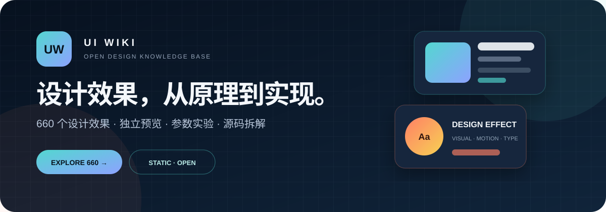

<div align="center">



# UI WIKI · 设计效果百科

### 看得见、玩得懂，也可以直接拆开研究的开放设计知识库

[](https://xvshiting.github.io/ui-wiki/)
[](https://github.com/xvshiting/ui-wiki)
[](https://xvshiting.github.io/ui-wiki/)

**600 个设计效果 · 600 个独立详情页 · 无后端 · 无构建依赖 · 开箱即用**

</div>

---

## 这是什么？

UI Wiki 收录 UI、交互、平面、封面、色彩与字体领域的常用设计语言。它不只是术语表：每个效果都有独立视觉示例、使用场景、设计原则、实时参数和可修改源码。

你可以用它寻找设计灵感、理解视觉机制、比较相近效果，或者直接学习一个效果如何由 HTML 与 CSS 构成。

> 不把“换个颜色或名字”算作新效果。每个词条都应具备可辨认的机制、专属预览和有意义的设计说明。

## 一眼看懂 UI Wiki

|  | 能做什么 | 适合谁 |
|---|---|---|
| **浏览** | 按领域、标签与二级分组探索 600 个效果 | 设计师、学生 |
| **试玩** | 直接操作点击、拖拽、滚动、指针与状态反馈 | 交互设计师、前端开发者 |
| **调参** | 修改颜色、间距、圆角、旋转、缩放和动效速度 | 设计系统与原型工作 |
| **拆解** | 查看、修改并重新运行当前效果的 HTML/CSS | 前端学习与实现参考 |
| **整理** | 收藏词条、记录最近浏览、加入效果对比 | 灵感收集与方案评审 |
| **复用** | 一键复制效果 CSS，带走当前设计思路 | 快速原型与实验 |

## 600 个效果，六个领域

| 分类 | 数量 | 包含内容 |
|---|---:|---|
| **UI 布局** | 107 | 导航、阅读、工作台、表单、地图、响应式与实验构图 |
| **UI 视觉** | 18 | 玻璃、光影、材质、渐变与界面风格 |
| **交互与动效** | 121 | 点击、导航转场、滚动、拖拽、手势、表单与反馈 |
| **平面设计** | 118 | 现代主义、复古风格、印刷、摄影、拼贴与信息设计 |
| **封面设计** | 118 | 字体、摄影、图像处理、插画、几何、材质与系列系统 |
| **色彩与字体** | 118 | 配色体系、渐变、无障碍色彩、字形、排版与动态字体 |

从网格布局、玻璃拟态、弹性动效和瑞士国际主义，到孔版印刷、千禧年美学、动态字体与图像蒙版，经典方法与当代数字视觉都可以在这里找到。

## 项目体验

- **专属预览**：600 个词条均有与原理对应的 HTML 结构和 CSS 表现。
- **真实交互**：按钮形变、拖拽吸附、卡片翻转、指针聚光等都可以操作。
- **参数实验室**：参数只影响当前预览，适合快速比较视觉差异。
- **源码 Playground**：修改代码后可立即在页面中重新运行。
- **本地收藏与对比**：使用浏览器 `localStorage`，不上传任何数据。
- **可访问性支持**：键盘焦点、语义标记与 `prefers-reduced-motion`。
- **离线可用**：核心资源都在仓库中，不依赖后端或数据库。

## 立即体验

### 在线访问

打开 **[xvshiting.github.io/ui-wiki →](https://xvshiting.github.io/ui-wiki/)**

项目由 GitHub Pages 直接托管。搜索、收藏、对比、调参和源码实验均在浏览器端完成。

### 本地运行

```bash
git clone git@github.com:xvshiting/ui-wiki.git
cd ui-wiki
python3 -m http.server 8000
```

访问 `http://localhost:8000/`。也可以直接打开 `index.html` 浏览主要内容。

## 技术结构

```text
ui-wiki/
├── index.html                  # 首页与六大领域入口
├── categories/                # 分类聚合页
├── terms/                     # 600 个独立效果详情页
├── data/
│   ├── lexicon.js             # 分类、基础词条与查询方法
│   ├── extra-terms.js         # 扩展效果数据
│   └── controls.js            # 参数定义与效果映射
├── assets/
│   ├── app.js                 # 搜索、收藏、对比与页面交互
│   ├── extra-demos.js         # 效果专属预览结构
│   ├── styles.css             # UI Wiki 界面样式
│   ├── motion-*.css           # 交互与动效机制
│   ├── fx-style.css           # 扩展视觉效果
│   └── browser.js             # 构建生成的离线浏览脚本
└── scripts/
    ├── build.mjs              # 生成分类页、详情页和浏览脚本
    ├── check-controls.mjs     # 检查参数是否真实映射
    ├── check-previews.mjs     # 检查预览完整性
    └── check-effect-fidelity.mjs # 防止效果退化为通用占位预览
```

## 添加一个新效果

1. 在 `data/lexicon.js` 或 `data/extra-terms.js` 添加词条。
2. 在 `assets/app.js` 或 `assets/extra-demos.js` 添加专属预览结构。
3. 在对应样式文件中实现真实机制。
4. 在 `data/controls.js` 只暴露真正生效的参数。
5. 重新生成静态页面并运行检查。

```bash
node scripts/build.mjs
node scripts/check-controls.mjs
node scripts/check-previews.mjs
node scripts/check-effect-fidelity.mjs
node scripts/check-semantic-interactions.mjs
```

## 贡献方向

欢迎贡献新的设计效果、优化现有预览、补充设计说明或改进无障碍体验。提交前请确认：

- 效果具有独立、可辨认的视觉或交互机制；
- 预览能够说明原理，而不是只展示一个装饰结果；
- 控件与代码确实会改变当前效果；
- 在窄屏和 `prefers-reduced-motion` 下仍然可用。

---

<div align="center">

### 如果 UI Wiki 给了你一点灵感，欢迎点一个 Star ★

**[在线体验](https://xvshiting.github.io/ui-wiki/)** · **[查看源码](https://github.com/xvshiting/ui-wiki)** · **[提交 Issue](https://github.com/xvshiting/ui-wiki/issues)**

Made for designers who like to understand how things work.

</div>
